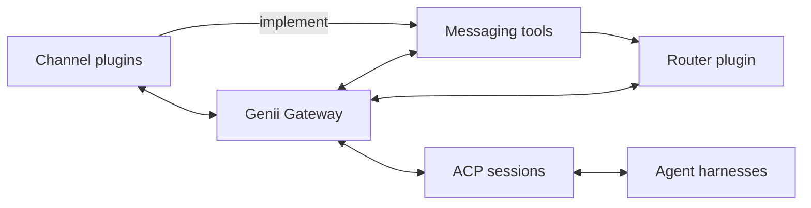

# Genii Gateway

Genii Gateway is a TypeScript application that connects chat services to agent
harnesses through the Agent Client Protocol, or ACP. It handles channels,
sessions, and message routing in one place, while the harnesses run models and
manage the agent loop.

Channel plugins translate terminal chat, Telegram, Mattermost, and other chat
services into a format the Gateway understands. Router plugins decide which ACP
session receives a message, who can take part in that session, and where each
response goes. A router can connect one conversation to one session or manage
more involved arrangements across several channels and sessions.

## What it does

- Carries rich text, files, media, reactions, and interactive controls between
  channels and agents.
- Routes new messages, follow-up messages, scheduled work, and agent responses.
- Gives agents a consistent set of tools for searching conversations, posting
  messages, replying in threads, and adding reactions.
- Builds the context for each turn from data supplied by channels, routers, and
  plugins.
- Runs separate profiles, each with its own configuration, credentials, plugin
  data, session records, and logs.
- Supports cron jobs and heartbeats through plugins that share the same routing
  system as channel messages.

## How it works

Channel plugins turn incoming activity into Gateway events. The router checks
the sender, chooses an ACP session, and decides how the event affects work in
progress. Plugins can then add context or tools for that turn.

Final messages and tool requests come back through the router, which chooses
and checks every destination. The channel plugin converts the result into the
format supported by Telegram, Mattermost, the terminal, or whichever service
will receive it.

The Gateway core manages sessions, channel operations, context, tools, plugin
loading, and profile data. Plugins build on that code to add channel support,
routing rules, schedules, memory, and other behavior.

## Plugins

The Genii Gateway project maintains plugins for a basic router, a CLI channel,
cron scheduling, heartbeats, memory, and corporate hierarchy. Plugins can
depend on one another, so the heartbeat plugin can use the scheduler instead of
running a separate clock.

## Documentation

The [architecture guide](docs/architecture.md) explains how messages move
through the Gateway and how sessions, routers, channels, context, tools,
profiles, and plugins work.
