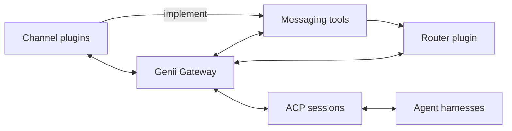

# Genii Gateway

Genii Gateway is a TypeScript application that connects chat services to agent
harnesses through the Agent Client Protocol, or ACP. It handles channels,
sessions, and message routing in one place, while the harnesses run models and
manage the agent loop.

Channel plugins translate terminal chat, Telegram, Mattermost, and other chat
services into a format the Gateway understands. Router plugins decide which ACP
session receives a message, who can take part in that session, and where each
response goes. A router can connect one conversation to one session or manage
more involved arrangements across several channels and sessions.

## What it does

- Carries rich text, files, media, reactions, and interactive controls between
  channels and agents.
- Routes new messages, follow-up messages, scheduled work, and agent responses.
- Gives agents a consistent set of tools for searching conversations, posting
  messages, replying in threads, and adding reactions.
- Builds the context for each turn from data supplied by channels, routers, and
  plugins.
- Runs separate profiles, each with its own configuration, credentials, plugin
  data, session records, and logs.
- Supports cron jobs and heartbeats through plugins that share the same routing
  system as channel messages.

## How it works



Channel plugins turn incoming activity into Gateway events. The router checks
the sender, chooses an ACP session, and decides how the event affects work in
progress. Plugins can then add context or tools for that turn.

Final messages and tool requests come back through the router, which chooses
and checks every destination. The channel plugin converts the result into the
format supported by Telegram, Mattermost, the terminal, or whichever service
will receive it.

The Gateway core manages sessions, channel operations, context, tools, plugin
loading, and profile data. Plugins build on that code to add channel support,
routing rules, schedules, memory, and other behavior.

## Plugins

The Genii Gateway project maintains plugins for a basic router, a CLI channel,
cron scheduling, heartbeats, memory, and corporate hierarchy. Plugins can
depend on one another, so the heartbeat plugin can use the scheduler instead of
running a separate clock.

## Repository layout

This repository uses a pnpm workspace, with packages stored below `packages`
and project documentation stored below `docs`. The initial workspace package
is `packages/gateway`, which provides the private `@usegenii/gateway` package
until the separate publication work is complete.

Configuration for TypeScript, Biome, pnpm, and Turborepo lives at the
repository root so each package follows the same development rules. Turborepo
runs package tasks from that root and keeps its local cache inside the current
checkout. Future packages related to the Gateway use the
`@usegenii/gateway-*` naming pattern.

## Development

Development uses Node.js 24 LTS. The root `packageManager` field pins the exact
pnpm version, which lets Corepack select the repository's package manager
without requiring contributors to manage a separate global pnpm version.
Enable Corepack and install the locked dependencies from the repository root:

```sh
corepack enable
pnpm install --frozen-lockfile
```

The root scripts send package work through Turborepo while keeping repository
wide formatting and linting in Biome. Run these commands from the repository
root:

| Command | Purpose |
| --- | --- |
| `pnpm format` | Runs Biome in write mode to format supported files and apply fixes that Biome classifies as safe. |
| `pnpm lint` | Checks source code, tests, JSON, and supported repository configuration without changing files. |
| `pnpm typecheck` | Runs each package's strict TypeScript checks through Turborepo without emitting build output. |
| `pnpm test` | Runs the test tasks currently defined by workspace packages through Turborepo. |
| `pnpm build` | Compiles each workspace package through Turborepo and writes its declared build outputs. |
| `pnpm check` | Validates formatting and lint rules before running type checks, tests, and builds without changing tracked files. |

## Toolchain decisions

Every package uses native ESM and strict TypeScript with NodeNext module
resolution so development, compiled output, and Node.js use the same module
rules. The Gateway build writes JavaScript, declarations, and source maps to
`packages/gateway/dist`, and expected failures use `neverthrow` instead of
exceptions.

Biome formats and lints the repository with tabs at an indent width of four,
single quotes for JavaScript and TypeScript strings, double quotes for TSX
properties, semicolons, and trailing commas wherever the syntax permits them.
The lint configuration also rejects barrel files, which keeps package entry
points explicit as the workspace grows.

The pnpm configuration saves exact dependency versions and waits three days
before accepting a newly published release. It also rejects trust downgrades
and exotic transitive sources. Dependency build scripts remain disabled unless
a maintainer explicitly allows the package in `pnpm-workspace.yaml`.

## Documentation

The [architecture guide](docs/architecture.md) explains how messages move
through the Gateway and how sessions, routers, channels, context, tools,
profiles, and plugins work.
