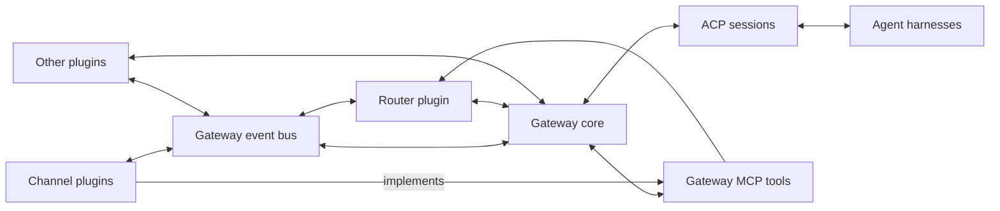

# Genii Gateway architecture

Genii Gateway connects chat services to agent harnesses through the Agent
Client Protocol, or ACP. The Gateway core contains the session and channel code
used throughout the application. Plugins add support for chat services, choose
how messages are routed, and provide features such as scheduling and memory.

## Main parts

The Gateway core manages ACP sessions, channel operations, context, tools,
plugin loading, and profile data. Plugins run inside the Gateway process and
use the core whenever they need to work with a session or channel.

ACP harnesses run models and manage the agent loop, including model providers,
planning, transcripts, history selection, compaction, and the model's context
window. The Gateway reaches that work through ACP.

## How messages move through the Gateway

The in-process event bus is where work begins inside the Gateway. It receives
channel events, scheduled triggers, ACP activity, tool requests, and plugin
lifecycle events, then calls the core and plugin handlers registered for each
event. Plugins can also define and handle their own namespaced events.

A channel interaction moves through these steps:

1. The channel plugin converts a native event into Gateway data.
2. The event bus sends the interaction to the active router.
3. The router checks the sender, chooses an ACP session, and decides how the
   interaction affects work in progress.
4. Core and plugins add context and choose the tools for the turn.
5. Core turns the context into text and sends the turn to the ACP session.
6. Final messages and tool requests come back through the router, which checks
   and chooses their destinations.
7. A channel plugin converts each result into the channel's native format.

Scheduled work and events created by plugins enter through the same event bus,
so the router handles them in the same way as channel messages.

## ACP sessions

ACP sessions have their own identity apart from channel conversations. Core
keeps the Gateway's session records and handles creation, resumption,
communication, cancellation, and supervision. The harness keeps the transcript
and its internal session data.

A shared catalog lists the available harnesses, and each profile selects the
harnesses it permits. Profiles can use the same harness definitions while
keeping their credentials, environment, permissions, and session records
separate.

## Routing and authorization

The active router decides:

- Which ACP session receives an incoming event.
- Whether a sender can start or join a session.
- Whether new activity steers, queues, interrupts, or starts work.
- What context or warnings accompany an interaction.
- Where final agent responses go.
- Where agent messaging requests go and whether the action is allowed.

Every final response and messaging tool request comes back through the router.
The router can deliver it, redirect it, send it to several destinations, or
suppress it. This decision also applies to direct responses, so returning a
message to its source channel is a routing rule.

Core keeps the ACP session records, while routers connect sessions to channels.
Those connections can be one-to-one, many-to-one, one-to-many, or changed as
the router runs. A router can keep settings for a session and accept channel
commands that change how it queues, steers, or interrupts work.

The basic router connects one channel conversation to one ACP session and lets
the user who started it contribute messages. Other routers can allow group
conversations, join several channels to one session, or select among several
sessions.

## Channels, conversations, and content

A channel plugin converts between a chat service and the Gateway. It decides
how direct messages, rooms, topics, and threads become conversations inside the
Gateway.

Core events cover changes to channels, conversations, participants, messages,
threads, reactions, interactive controls, attachments, delivery, presence,
moderation, ACP sessions, schedules, and plugins. A plugin can add namespaced
events for behavior specific to a service or feature.

The Gateway keeps incoming content as data that can hold formatted text,
quotations, links, mentions, images, video, audio, files, and interactive
controls. Agent responses use the same kind of data. Each channel plugin then
converts the response into something its service supports. A card can become
formatted text, a button can become a numbered choice or link, and inline media
can become an attachment or download link.

The result of an operation tells the agent whether it succeeded and explains
unsupported, denied, unavailable, or invalid actions. Interactive replies come
back as Gateway events for the router to check and send to a session.

## Context

The Gateway keeps channel, routing, and plugin context as separate data objects
until it sends a turn to ACP. Once the router checks the interaction and chooses
a session, plugins can add, replace, reorder, summarize, or remove those
objects. Core converts the finished set into text immediately before sending
the turn.

Memory, corporate hierarchy, and context optimization plugins edit the same
objects. They can change how routing facts and warnings appear to the agent,
while the router's permission decision stays in force.

## Agent tools

The Gateway gives ACP sessions tools through a Gateway-managed Model Context
Protocol connection. Core handles the general messaging operation, the channel
plugin handles the chat service, and the router checks and chooses the target.

Core and plugins can add, hide, or change tools for each turn when the ACP
harness and MCP client accept tool changes during a session. If several plugins
register the same tool name, they form a chain in reverse registration order.
Each plugin in the chain can change the request or result, pass control to the
next plugin, or stop the call.

This chain lets plugins apply authorization, logging, format conversion, or
caching around the channel operation in one place.

## Requests for human input

When an ACP harness asks for permission or more information, the router chooses
who can answer, where the request appears, and how the answer reaches the ACP
session. The channel plugin presents the request as text, buttons, a form, or
another format available in that service.

## Profiles

Each Gateway process runs one profile. The profile holds its configuration,
credentials, Gateway data, ACP session records, router settings, plugins,
channel accounts, and rotated log. Plugins store their schedules, memory,
hierarchy data, and other records in the same profile.

Profiles can share harness definitions while keeping secrets and running data
separate. ACP harness processes receive the environment set by the profile, and
tools use the profile's channel credentials after the router approves an
action.

## Plugin relationships

Plugins can depend on other plugins and call their services. The plugin host
checks these dependencies and starts them in the required order. The scheduling
plugin runs cron jobs, and the heartbeat plugin uses that scheduler to create
heartbeat events and route their responses.

The project maintains these plugins:

- The basic router connects one conversation to one ACP session.
- The CLI channel provides chat in a terminal.
- The scheduling plugin runs cron jobs.
- The heartbeat plugin starts scheduled agent turns and routes their responses.
- The memory plugin adds stored information and memory tools to a turn.
- The corporate hierarchy plugin adds roles, reporting relationships,
  delegation instructions, and services for compatible routers.

The basic router and CLI channel provide a complete route through the Gateway.
Every other plugin uses the same events, sessions, context, and tools.
